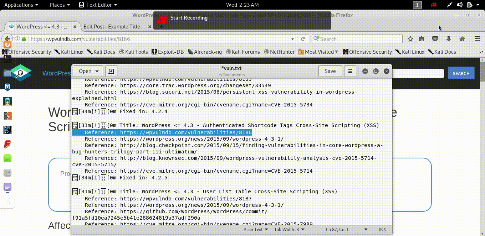
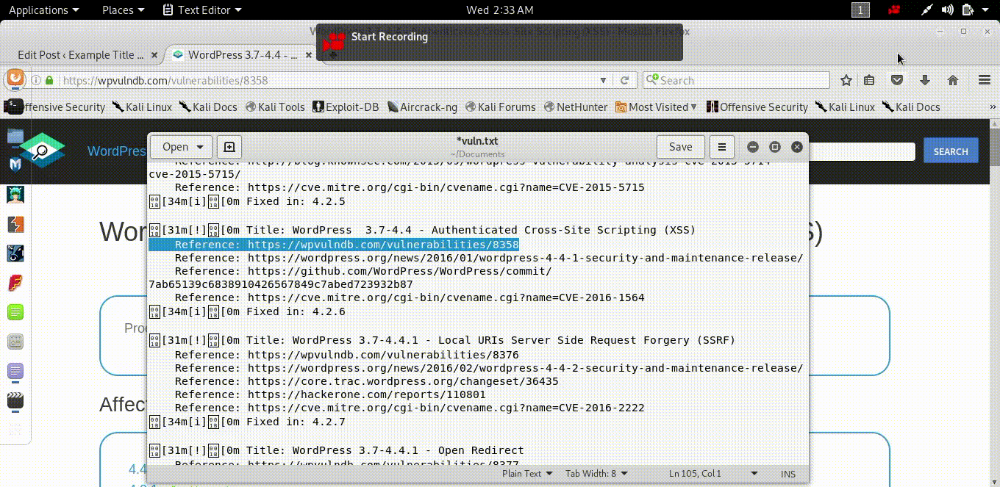
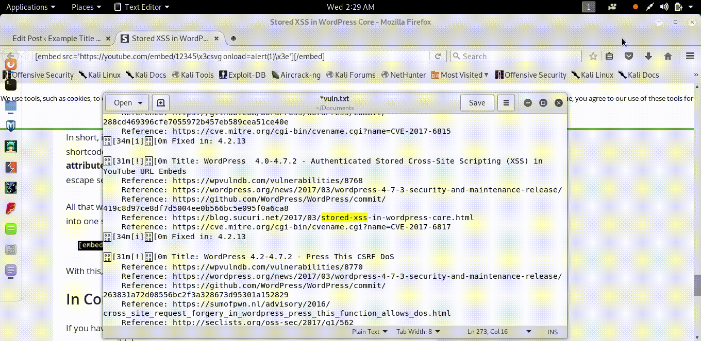

# codepath_week7

Week 7 submission for Codepath.

## Exploit 1
### WordPress <= 4.2.3 – Nav Menu Title Cross-Site Scripting (XSS)

I used this site for reference (https://wpvulndb.com/vulnerabilities/8186) . The reference noted that you simply copy and paste the following on a page or post, but not in comments.

`TEST!!![caption width="1" caption='<a href="' ">]</a><a href="http://onMouseOver='alert(1)'">Click me</a>`

So I did just that. As seen below. Make sure you are in Word Press’s text mode.  
What makes this exploit deadly is that it comes with the default Word Press and that malicious JavaScript could be executed simply by hovering over text.


## Exploit 2
### Word Press 4.0-4.7.2 – Authenticated Stored Cross-Site Scripting (XSS) in YouTube URL Embeds

The reference I used was (https://blog.sucuri.net/2017/03/stored-xss-in-wordpress-core.html) .  Essentially this exploit took advantage of how an older advantage of core WordPress handles youtube videos. However, this exploit requires at least Contributor privileges on WordPress.
As the reference states, I copy and pasted the following :

`[embed src='https://youtube.com/embed/12345\x3csvg onload=alert(1)\x3e'][/embed]`

I did this in a new post, making sure that I’m in text mode. This is seen below.
 
Now if we visit the site, we get the following. As we can see, JavaScript is run simply by going to the page with the YouTube video. This could be quite deadly if I was a malicious user instead.


## Exploit 3
### WordPress 3.7-4.4 – Authenticated Cross-Site Scripting (XSS)

For this exploit, I used the reference (https://wpvulndb.com/vulnerabilities/8358) . This exploit didn’t really have instructions but the instructions should be familiar. As seen below, just copy and paste the following below in a WordPress post.

```http://www.example.com/wp-admin/customize.php?theme=<svg onload=alert(1)> (source: https://twitter.com/brutelogic/status/685105483397619713)```

Make sure you are once again in the Text mode of a post
 
Publishing this gives you the following the moment you load onto the page.
 
Essentially the onload JavaScript runs the moment you get onto the page, executing some JavaScript. In this scenario, nothing malevolent is occurring. However, if I was an attacker, I could put more damaging JavaScript that would instantly run when loading a page.

